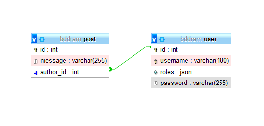
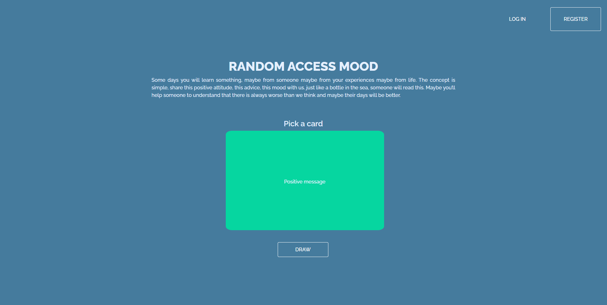
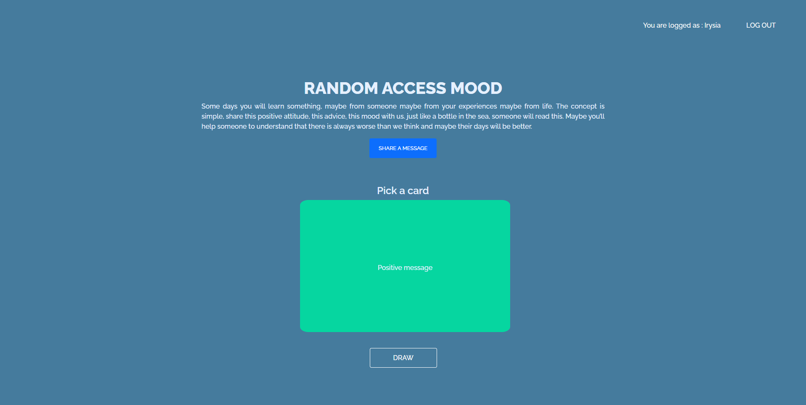

# 

Random Access Mood is an initative project to help people to feel better. This project is just a way to improve my skills with a positive approche. Just send a positiv message and someone will read it.

**Tech used**.

- Php
- Twig
- Faker
- Symfony
- Composer
- Html | Css
- Mysql | SQLite


    <br>
     <br>

## DATABASE

With a simple 2 tables database i can link users to posts that they will create. The goal was not to control an history of the users' posts. The username is just here to sign your message, and it's impossible to delete a post. The purpose of the project is like that of sending a message in a bottle.

<p align="center">

</p>

## CONCEPT

You can use the website in two ways.

- Use it to see some of the messages and draw a new card to see a new one.
  <p align="center">
  
  </p>
- Sign up then access the possibility to write a card.
  <p align="center">
  
  </p>

You just have to over a card to see it, that's it !

## How randomization works

```php
public  function  getRandomMessage(){

$numberOfMessage = $this->count([]);

$randomInt = random_int(0, $numberOfMessage - 1);

$query = $this->createQueryBuilder('p')

->setMaxResults(1)

->setFirstResult($randomInt)

->getQuery();

return  $query->getResult()[0];

}
```

## End

If you want to share a card i recommend you to use it now ! Just be positive, it can be a good news in your life, a positive message or a good lesson to learn, just be kind.

[Random Access Mood ](http://whispering-ravine-34894.herokuapp.com/)

Thank you.
